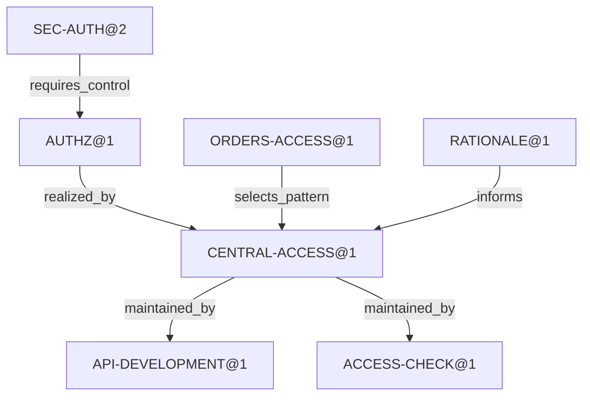

# Пример: изменение требования доступа к endpoint

## Назначение и границы

Сценарий иллюстрирует [модель требований и методов](../../semantic-model/requirements-and-methods.md) и [процесс изменения требований](../../workflows/requirement-change.md). [scenario.yaml](scenario.yaml) содержит конкретные записи, пути графа и последовательность этапов.

Все проекты, источники `fixture:`, версии пакетов, решения человека и Evidence условные. Они не являются результатами запуска Trellis, проверки Spring-приложения или публикации пакетов. YAML представляет набор записей нескольких этапов; он не является одним принятым Knowledge State. Внешние типы Framework приведены в минимальном объёме, нужном для сценария; это не полные API-схемы.

Ключ `id@revision` адресует запись в `nodes`. `model_ref` ссылается на общий каталог; новые типы внутри примера не определяются. `stages` показывает сокращённые проекции этапов: поздние записи не считаются доступными в ранней ревизии. Итоги WorkItem относятся к концу сценария; ход выполнения хранится отдельно от идентичности задачи.

## Исходная ситуация

В Knowledge State K10 принято требование SEC-AUTH@1: все endpoints, кроме явно принятых публичных исключений, требуют аутентификацию. Для ORDERS инвентаризация фиксирует три защищённых маршрута и публичный `GET /health`. Публичное исключение имеет собственное обоснование и решение PUBLIC-REVIEW@1.

ORDERS использует общий способ CENTRAL-ACCESS@1. Точка приложения — конфигурация безопасности приложения и проверки доступа к операциям/ресурсам. Требование относится к endpoint; изменение относится к инженерной области SERVICE-DESIGN. У LEGACY механизм защиты и полнота перечня endpoints неизвестны.

API-DEVELOPMENT@1 описывает разработку с проверкой личности. ACCESS-CHECK@1 уже способен проверять переданную матрицу разрешённого и запрещённого доступа, но его пригодность для новой нормы ещё должна быть подтверждена. Исследование RATIONALE@1 объясняет выбор централизованного подхода и сохраняется как знание.

## Смысл изменения

SEC-AUTH@2 добавляет обязательную авторизацию. Область маршрутов и публичное исключение остаются прежними. Дополнительный Control AUTHZ@1 требует проверки прав на операции и ресурсы. Наличие аутентификации не считается выполнением этого Control.

Пример трассировки:

Для LEGACY такого пути пока нет, поэтому создаётся исследовательская работа. Полный набор направленных отношений находится в YAML; анализ влияния может обходить отношения в обе стороны с учётом их смысла.

## План и human review

PLAN@1 относительно K10 содержит:

| Пункт | Действие | Результат работы |
| --- | --- | --- |
| update-skill | Update API-DEVELOPMENT@1 | Новая версия процедуры разработки и review её содержимого. |
| check-validator | Check ACCESS-CHECK@1 | Проверка пригодности; в сценарии завершается обоснованным no change. |
| update-project | Update ORDERS-ACCESS@1 | Исправление приложения после принятых результатов первых двух пунктов. |
| investigate-legacy | Check LEGACY@1 | Установление применимости, механизма и состава endpoints. |
| retain-rationale | No change RATIONALE@1 | Исследование рассмотрено, его смысл не изменился. |

Человек подтверждает SEC-AUTH@2 и PLAN@1 решением PLAN-REVIEW@1 для CS-REQUIREMENT@1. Knowledge применяет изменение и создаёт K11. Пункты, требующие работы, связаны с WI-SKILL, WI-CHECK, WI-PROJECT и WI-LEGACY. Повторное получение плана не создаёт вторую задачу для того же пункта.

## Изменение методов

Содержательная разница навыка иллюстрируется так:

| API-DEVELOPMENT@1 | API-DEVELOPMENT@2 |
| --- | --- |
| Определить защищённые маршруты и публичные исключения. | Определить маршруты, публичные исключения, операции и ресурсы доступа. |
| Задать общую проверку личности. | Задать проверку личности и правила разрешения доступа с явной матрицей прав. |
| Проверить анонимный и аутентифицированный запрос. | Проверить анонимный запрос, недостаточные права, достаточные права и доступ к конкретному ресурсу. |
| Представить результаты проверки и исключения. | Представить инвентаризацию, матрицу прав, результаты проверок и принятые исключения. |

Это пример изменения содержимого, а не готовый устанавливаемый Skill. Исходники новой версии условно находятся в `fixture:methods/commit-B#api-development`.

WI-CHECK подтверждает, что ACCESS-CHECK@1 уже поддерживает нужную матрицу. Пакет/артефакт остаётся прежним, а CHECK-REPORT@1 и METHODS-COVERAGE@2 фиксируют новую проверку относительно SEC-AUTH@2. Старые `requirement_refs` и происхождение ACCESS-CHECK@1 не переписываются.

METHOD-REVIEW@1 явно принимает результат и оценку methods, а также разрешает публикацию конкретной подготовленной версии API-DEVELOPMENT 2.0.0. Это отдельное решение после первоначального review плана. Для валидатора используется внешняя версия; новый тип пакета Registry не вводится.

## Публикация и подключение

На S3 новая версия навыка опубликована, но ORDERS всё ещё выбирает API-DEVELOPMENT@1. Оценка methods уже положительная для нового набора, а оценка реализации ORDERS остаётся partial.

На S4 отдельное ADOPTION-REVIEW@1 разрешает выбор API-DEVELOPMENT@2 и прежнего ACCESS-CHECK@1 для новых запусков ORDERS. Runtime подтверждает подключение, Knowledge сохраняет ORDERS-METHODS@1. Уже начатый запуск продолжает использовать зафиксированные входные версии.

## Исправление проекта и проверка покрытия

WI-PROJECT приводит к ORDERS-ACCESS@2, связанному с `fixture:orders/commit-B`. PROJECT-REPORT@2 описывает условную проверку всей инвентаризации INVENTORY@1: личность, права на операции и ресурсы, отрицательные и положительные случаи, публичное исключение. PROJECT-REVIEW@1 принимает этот конкретный результат и оценку project.

| Момент | Покрытие методами | ORDERS | LEGACY |
| --- | --- | --- | --- |
| После принятия новой нормы | Прежняя оценка требует review | Нужна оценка относительно SEC-AUTH@2 | Unknown |
| После обновления методов | Covered для API-DEVELOPMENT@2 и ACCESS-CHECK@1 | Partial для commit-A | Unknown |
| После исправления ORDERS | Covered в заявленной области методов | Covered для commit-B и INVENTORY@1 | Unknown, WI-LEGACY открыт |

Историческая METHODS-COVERAGE@1 остаётся положительной для SEC-AUTH@1. При запросе относительно новой нормы она помечается `needs_review`; её прошлый результат не меняется. Новая оценка создаётся отдельно.

Сценарий завершается с открытой работой LEGACY. Положительный результат методов и ORDERS не распространяется за пределы проверенного scope. Принятое требование продолжает существовать вместе с явно видимым обязательством выяснить и устранить этот пробел.

## Что проверяет пример

- Требование адресует endpoint, а реализация и задача могут относиться ко всему приложению.
- Нормативная связь, путь влияния и Evidence имеют разное назначение.
- Навык может быть выходом WorkItem, сохраняя независимость от входных навыков запуска.
- `check` может завершиться подтверждением прежнего артефакта без изменения содержимого.
- Принятие плана, review результата, публикация и подключение не подменяют друг друга.
- Положительная оценка methods не создаёт автоматически положительную оценку project.
- Неизвестное покрытие остаётся явным и связано с работой, а не исчезает после публикации пакета.
